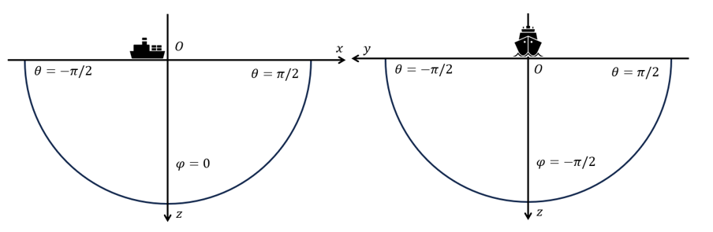
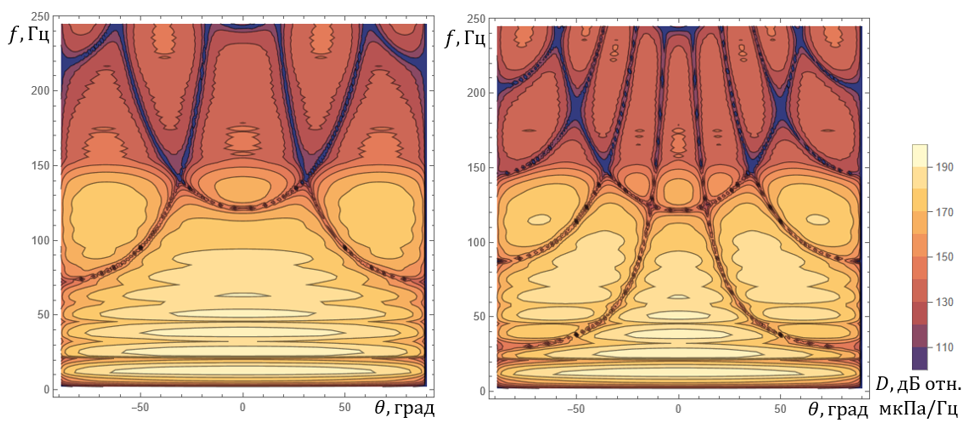

# Библиотека для моделирования и обработки сигналов морских пневматических источников

**Библиотека для моделирования и обработки сигналов морских пневматических источников** – набор инструментов, который позволяет проводить предварительную обработку и суммирование исходных акустических распределённых сигналов (в том числе от пневматических источников). Программные компоненты модуля позволяют различными методами провести предварительную фильтрацию исходных распределенных сигналов и рассчитать итоговый сигнал в заданной точке пространства, с учетом его затухания и отражения. Реализована модель расчета акустического сигнала от группового морского пневматического источника. Модель основана на численном решении уравнений Келлера-Колоднера, описывающих процесс пульсации воздушной полости в сжимаемой жидкости. Присутствует функционал, позволяющий настраивать параметры модели на внешне заданные сигнатуры источников, который основан на применении генетического алгоритма. 


## Установка

Установка не предполагается.

<!---
## Разработка

Разработка UI приветствуется.
-->

### Сборка

Используется система сборки CMake.

Главный файл находится в каталоге `app\gund_solvers`.

Для сборки тестов указывается опция `WITH_TESTS`.

Используемые сторонние библиотеки:
- [nlohmann](https://github.com/nlohmann/json/releases/)
- [Simple-FFT](https://github.com/d1vanov/Simple-FFT)


## Функциональность

Учтено отражение от водной поверхности.

Исходные акустические распределённые сигналы зачитываются из файлов `*.sig`.

Поддерживаются различные варианты предварительной фильтрации исходных распределенных сигналов.

Имеется возможность создания кастомных bandpass фильтров с заданной полосой пропускания, с линейной и минимальной фазой.

Добавлена библиотека с функционалом, позволяющим численно моделировать акустический сигнал от индивидуальных и групповых пневмо-источников с использованием методов Рунге-Кутты.

Добавлен оптимизатор параметров дифференциальной модели, позволяющий делать настройку на внешне заданные сигнатуры. В основе оптимизатора лежит генетический алгоритм. 

## Обработка сигналов

Для организации предварительной подготовки и суммирования исходных акустических распределенных сигналов (в том числе от пневматических источников), следует корректно сформировать входные данные для модели. Для упрощенного использования библиотеки заполнение производится в файл .json определенного вида.
### Подготовка входных данных
Входные данные должны включать информацию об источнике распределенных сигналов: имя, тип источника, его расположение в декартовых координатах (м), объем (cuin) и давление (psi) внутри камеры источника, коэффициент заполнения камеры и температуру (С).
Пример входных данных для одного источника представлен ниже:
```
"gunArray": [
		{
			"name": 0,
			"type": "1500C",
			"coordinate": {
				"x": 0.0,
				"y": 0.0,
				"z": 6.0
			},
			"volume": 100.0,
			"pressure": 2000.0,
			"shapeRatio": 1.0,
			"temperature": 0
		}
	]
```
Заполнение свойств среды включает информацию о скорости звука (м/с) и температуре в среде (С):
```
"physicalParameters": {
		"temperature": 0,
		"soundVelocity": 1496.0
	}
```
Генерация сигнала может включать отражение от поверхности, заданное значением коэффициента отражения в промежутке от -1 до 0, и изменение координат точки наблюдения (при желании задать соответствующие координаты требуется выбрать режим `"infiniteType": false`):
```
"reflection": {
		"coeff": 0.0
	},
"observationPoint": {
		"infiniteType": true,
		"coordinate": {
			"x": null,
			"y": null,
			"z": null
		}
	}
```
Параметры генерации итогового сигнала, такие как величина шага по времени (с) и количество отсчетов должны быть заданы в формате:
```
"sigParams": {
		"sampleInterval": 0.0005,
		"sampleNum": 1000
	}
```
При желании использовать фильтр, его характеристика должна быть помещена в каталог `data`, а название прописано в соответствующей строке .json:
```
"filter": {
		"accessMode": "EXTERNAL",
		"filename": "filtername.flt"
	}
```
Пример заполнения входных данных находится в каталоге `test\spectrum_solver_test\test_data`.
### Применение модели
Применение модели основано на использовании общего класса с несколькими открытыми пользователю функциями. Рассмотрим подробнее.
##### Получение входных данных
Для упрощенного взаимодействия с библиотекой присутствует функция `parseInitJson()`, автоматически читающая в заполненный ранее .json файл параметры `params` и `options`:
```
std::string json = "start_file.json";
SpectrumSolverParams params;
SpectrumSolverOptions options;
parseInitJson(json, params, options);
```
##### Суммирование и обработка исходных акустооптических распределенных сигналов
Для создания модели используется класс `SpectrumSolver`, предполагающий заполнение адреса расположения файлов с предподготовленными сигнатурами единичных источников, в данном примере обозначенного с помощью строки `dataPath`:
```
SpectrumSolver solver(params, options);
solver.setDataPath(dataPath);
```
Применение модели зависит только от входных параметров, таких как коэффициент отражения, наличие фильтрации и т.д. Поэтому применение модели возможно с помощью функции `solve`:
```
solver.solve();
```
##### Диаграммы направленности
Диаграмма направленности системы пневмоисточников представляет собой зависимость амплитуды (дБ) итогового акустического поля в частотной области от частоты $$f$$ и полярного угла $$\theta$$ сферической системы координат (отметим, что ось $$Ox$$ направлена против движения корабля-носителя, а ось $$Oy$$ в направлении морского дна). По ней можно судить о том, в каком направлении распространяется наиболее интенсивный сигнал. Для построения диаграммы направленности используется класс `Diagram`, конструктор которого принимает на вход структуры `DiagramParams, DiagramOptions`:

```
struct DiagramParams {
    std::vector<DelayedGun> gunArray;
    gund_structs::PhysicalParameters physParams;
};

struct DiagramOptions {
    gund_structs::Reflection reflection;
    gund_structs::Filter filter;
    gund_structs::SignatureParameters sigParams;
};
```

Здесь допускаются источники с заданной задержкой `delay` момента запуска:
```
struct DelayedGun : gund_structs::Gun {
    double delay;
};
```
Вывод результатов построения диаграммы направленности осуществляется в json-файл в табличном виде при помощи метода `outputDiagram`, аргументом которого является структура `OutputDiagramOptions` с настраиваемыми параметрами вывода:
```
struct OutputDiagramOptions {
    std::string outputFileName;
    double azimut; // degrees
    double maxDipAngle = 90; // degrees
    double dipIncr = 1; // degrees
    double lowerDB = 100; // dB
    double higherDB = 210; // dB 
};
```
Диаграммы направленности различаются по выбору плоскости азимутального угла $$\phi$$ (он же `azimut`) сферической системы координат. Имеется два базовых случая: `azimut == 0` -- продольный, и `zimut == -pi/2` -- поперечный.

На картинке ниже приведен пример отрисовки продольной и поперечной диаграмм направленности для системы из двух пневмоисточников. Отрисовка производилась средствами Wolfram Mathematica.

Также создавать и выгружать диаграммы направленности можно из класса `SpectrumSolver` при помощи метода `computeDiagrams`. При таком подходе будут использованы полученные ранее [входные данные](#получение-входных-данных) о сборке пневмоисточников из json-файла.

##### Энергетические величины
В классе `Energy` производится расчет таких характеристик, как энергетический центр системы пневмоисточников, полная акустическая энергия, индивидуальный акустический вклад источника, полная потенциальная энергия и акустический КПД системы. Полная потенциальная энергия представляется суммой $$E_\text{potential}=\sum p_i V_i$$ по всем пневмоисточникам внутренних энергий содержащегося в них газа до запуска процесса эмиссии. Затем каждый из источников вносит свой вклад $$E_i$$ в полную акустическую энергию $$E_\text{acoustic}=\sum E_i$$ создаваемого в воде поля давления. При формировании акустического поля происходит попарное взаимодействие между источниками, которое влияет на их индивидуальные вклады $$E_i$$. В результате такого взаимодействия может даже оказаться, что некоторые из вкладов окажутся отрицательными. Однако это не означает, что соответствующие пневмоисточники в системе являются лишними, -- скорее наоборот, они выступают в роли катализаторов, усиливая энергетические вклады от других источников. Энергетический центр представляет собой точку, задаваемую радиус-вектором $$\sum \frac{E_i}{E_\text{acoustic}}\textbf{r}_ i$$, где $$\textbf{r}_ i$$ -- радиус-векторы пневмоисточников. КПД акустического поля определяется отношением $$E_\text{acoustic} / E_\text{potential}$$.\
Конструктор класса `Energy` принимает на вход структуры `EnergyParams, EnergyOptions`. В результате формируется структура `EnergyResult`:
```
struct EnergyResult {
    std::vector<double> energy;
    struct { double x, y, z; } energyCenter;
    double totalAcousticEnergy;
    double totalPotentialEnergy;
    double acousticEnergyEffectiveness;
};
```
Для включения полученных данных в итоговый отчет на основе [входных данных](#получение-входных-данных) в классе `SpectrumSolver` предусмотрен метод `computeEnergyParams`.

##### Выгрузка результатов
Результаты моделирования всех доступных в библиотеке данных хранятся в параметре `result`:
```
auto result = solver.solve();
```
В случае возникновения ошибок во время моделирования соответствующее сообщение будет выгружено пользователю в параметр `result`. Для обработки таких событий рекомендуется использовать конструкцию:
```
auto result = solver.solve();
if (std::holds_alternative<SpectrumResult>(result)) {
    auto& res = std::get<SpectrumResult>(result)
}
else {
    auto& strError = std::get<std::string>(result)
} 
```
При корректных входных данных параметр `res` из примера выше содержит в себе значения результирующего сигнала `res.signal` и амплитуды спектральной характеристики `res.ampSpec`, амплитуда выражена в дБ. Также, можно получить информацию об индивидуальных вкладах источников сигнала `res.singleContrib`, характеризующую как энергетические, так и вклады по приросту давления. Значения инженерных параметров находятся в параметре `res.rParams` и включают величины, такие как peak-to-peak (выраженное в бар и дБ), zero-to-peak, bubble-period (с) и другие, а также упомянутые ранее центры энергии и давления и геометрический центр. 
Дополнительные комментарии, возникшие в ходе выполнения конкретной модели, можно получить, вызвав функцию:
```
solver.getMessages();
```

## Создание кастомных фильтров

### Обзор

Bandpass-фильтры используются для выделения полезных сигналов в определенном частотном диапазоне, подавляя шумы и помехи за его пределами. Они особенно важны при обработке сигналов от морских пневмо источников, где необходимо выделить полезные сейсмические данные на фоне шумов.

### Основные понятия

#### Bandpass-фильтрация

- **Назначение**: Выделение частот между `low_pass` и `high_pass`
- **Реализация**: Свёртка с импульсной характеристикой фильтра
- **Ключевые параметры**:
  1. Частоты среза (Гц)
  2. Крутизна среза (dB/октава)
  3. Весовые окна (уменьшение эффекта Гиббса)

#### Фазовые характеристики

- **Zero-phase (линейная фаза)**: Не искажает фазу сигнала, но имеет задержку
- **Minimal-phase**: Минимизирует задержку, но вносит фазовые искажения

### Классы для работы с фильтрами

#### Базовый класс `AbstractInternalFilter`

```
class AbstractInternalFilter {
public:
    // Конструктор с параметрами фильтра
    AbstractInternalFilter(std::string filtername_, double sampleInterval_, 
                          gund_structs::BandpassFilter::InternalFilter filterParams,
                          Window::WindowType low_window_type_, 
                          Window::WindowType high_window_type_);
    
    // Применить фильтр к сигналу (абстрактный метод)
    virtual void apply(const std::vector<double>& signal, 
                      std::vector<double>& filtered_signal) const = 0;
    
    // Получить импульсную характеристику
    const std::vector<double>& getImpulse() const;
    
    // Сохранить данные фильтра в файл
    void printInFile(std::string dataPath) const;
};
```

#### Фильтр с линейной фазой `InternalZeroPhaseFilter`

```
class InternalZeroPhaseFilter : public AbstractInternalFilter {
public:
    InternalZeroPhaseFilter(std::string filtername_, double sampleInterval_,
                          gund_structs::BandpassFilter::InternalFilter filterParams,
                          Window::WindowType low_window_type_ = Window::WindowType::HAMMING,
                          Window::WindowType high_window_type_ = Window::WindowType::HAMMING);
    
    void apply(const std::vector<double>& signal, 
              std::vector<double>& filtered_signal) const override;
};
```

#### Фильтр с минимальной фазой `InternalMinimalPhaseFilter`

```
class InternalMinimalPhaseFilter : public AbstractInternalFilter {
public:
    InternalMinimalPhaseFilter(std::string filtername_, double sampleInterval_,
                             gund_structs::BandpassFilter::InternalFilter filterParams,
                             Window::WindowType low_window_type_ = Window::WindowType::HAMMING,
                             Window::WindowType high_window_type_ = Window::WindowType::HAMMING);
    
    void apply(const std::vector<double>& signal, 
              std::vector<double>& filtered_signal) const override;
};
```

### Пример использования

```
// Параметры фильтра
gund_structs::BandpassFilter::InternalFilter params;
params.lowCutOffFrec = 10.0;  // Нижняя частота среза (Гц)
params.highCutOffFrec = 100.0; // Верхняя частота среза (Гц)
params.lowCutOffSlope = 24.0;  // Крутизна нижнего среза (dB/oct)
params.highCutOffSlope = 24.0; // Крутизна верхнего среза (dB/oct)

double sampleInterval = 0.001; // Интервал дискретизации (1 мс)

// Создание фильтра с линейной фазой
InternalZeroPhaseFilter zeroPhaseFilter("BP_10-100Hz.flt", sampleInterval, params);

// Применение фильтра к сигналу
std::vector<double> inputSignal = {...}; // Входной сигнал
std::vector<double> filteredSignal;
zeroPhaseFilter.apply(inputSignal, filteredSignal);
```

### Советы по выбору параметров

1. **Частоты среза**: Выбирайте исходя из спектра полезного сигнала
2. **Оконные функции**:
 - `WindowType::HAMMING` - хороший компромисс между подавлением боковых лепестков и шириной главного лепестка
 - `WindowType::HANN` - лучше подавление боковых лепестков
 - `WindowType::BLACKMAN` - максимальное подавление, но шире переходная зона
3. **Тип фильтра**:
 - Zero-phase - когда важна сохранность формы сигнала
 - Minimal-phase - когда важна минимальная задержка

Для морских сейсмических данных часто предпочтительны фильтры с линейной фазой, так как они сохраняют временные соотношения между событиями.

## Моделирование сигналов

### Физическая модель

Библиотека реализует модель акустического сигнала, генерируемого группой морских пневмоисточников (air guns), основанную на следующих физических принципах:

1. **Модель Келлера-Колоднера** описывает динамику пузыря, образующегося при выбросе сжатого воздуха:
 - Уравнение движения пузыря с учетом сжимаемости жидкости
 - Акустическое излучение от пузыря как монопольного источника
 - Учет взаимодействия пузырей через акустическое поле от других источников и отраженных сигналов (ghost) от поверхности воды

2. **Термодинамические процессы**:
 - Уравнение состояния идеального газа для воздуха в пузыре и в камере пневмоисточника
 - Теплообмен между газом в пузыре и окружающей водой
 - Массовый расход воздуха через порт пневмоисточника (уравнение Бернулли)

### Численные методы

Библиотека предоставляет два варианта решения системы дифференциальных уравнений:

1. **Явный метод Рунге-Кутта 4-го порядка (`RungeKuttaExplicit`)**
 - Простая реализация
 - Требует малого шага по времени для устойчивости

2. **Неявный метод Рунге-Кутта (`RungeKuttaImplicit`)**
 - Более устойчив для жестких систем
 - Требует итерационного решения на каждом шаге

Вычисления **распараллеливаются** с помощью `OpenMP` для обработки группы пневмоисточников.

### Основные классы

#### `GunArraySolver`

Главный класс для решения системы дифференциальных уравнений модели. Основные методы:
    - `solve()` - запуск расчета
    - `getSignal(...)` - получение сигнала в заданной точке
    - `getSignatureInfinity()` - расчет вертикальной сигнатуры в дальней зоне
    - `getResult()` - получение результатов расчета (список сигнатур всех источников)

Конструктор класса `GunArraySolver` принимает на вход объекты `PhysParams`, `MethodParams`, `GunArray`. Для выбора метода решения используйте параметр шаблона: `GunArraySolver<RungeKuttaExplicit<6>>` или `GunArraySolver<RungeKuttaImplicit<6>>`.

#### `PhysParams`

Содержит физические параметры среды:

```
struct PhysParams {
	double c = 1496; // скорость звука
	double rho = 1020.; // плотность соленой воды
	double ref = -1.; // коэффициент отражения
	double T_sea = 282; // температура воды
};
```

#### `MethodParams`

Параметры численного метода:

```
struct MethodParams {
	size_t N; // размер сетки
	double dt; // шаг по времени
    int numtreads; // параметр параллельных вычислений
    ...
};
```

#### `GunArray`

Контейнер для группы пневмоисточников типа `Gun`. Позволяет:

- Добавлять источники с различными параметрами `emplace_back`
- Обращаться к отдельным источникам по индексу `operator[]`

#### `Gun`

Описывает отдельный пневмоисточник. Имеет три атрибута `GunPhysics`, `GunInputs`, `GunType`:

```
class Gun {
public:
	GunPhysics GP;
	GunInputs GI;
    GunType GT;
    ...
};
```

##### `GunPhysics`

Содержит физические постоянные, описывающие термодинамические свойства газа (по умолчанию воздуха) для конкретного источника:

```
struct GunPhysics {
	double kappa = 4000; // коэффициент теплопроводности воздух/вода
	double cv = 717.258; // удельная теплоемкость воздуха при постоянном объеме
	double cp = 1006.313; // удельная теплоемкость воздуха при постоянном давлении
	double gamma = cp / cv; // индекс адиабаты
	double Q = cp - cv; // удельная газовая постоянная
};
```

##### `GunInputs`

Содержит задаваемые пользователем физические величины, описывающие начальное состояние и расположение пушки:

```
struct GunInputs {
	double P; // начальное давление в камере пневмоисточника
	double Vol; // объем камеры
	double delay; // задержка выстрела
	double x, y, z; // координаты расположения пушки
};
```

##### `GunType`

Скрытые от пользователя свободные параметры модели, позволяющие совершить настройку сигнатуры конкретной модели пневмоисточника на натурные данные или данные, полученные с помощью программных аналогов.

### Рекомендации по использованию

1. **Инициализация**: 
    - Создайте объекты `PhysParams` и `MethodParams` с нужными параметрами
    - Заполните `GunArray` пневмоисточниками с заданными координатами и характеристиками

2. **Выбор солвера**:
    - Для простых случаев используйте `RungeKuttaExplicit`
    - Для жестких систем или больших интервалов времени - `RungeKuttaImplicit`

3. **Параллельные вычисления**:
    - Установите `numtreads` в `MethodParams` для оптимального использования процессора
    - Убедитесь, что шаг по времени достаточно мал для устойчивости

4. **Анализ результатов**:
    - Используйте `getResult()` для получения полного набора сигнатур, которые готовы для обработки методами `SpectrumSolver`
    - Для визуализации "на месте" применяйте `getSignal(...)` или `getSignatureInfinity()`
    - Воспользуйтесь `enum Cached` и `getCache(...)` для записи и получения других физических данных. Например, давлений в пузырях, температур, и.т.д.

5. **Валидация**:
    - Сравните результаты с экспериментальными данными или программными аналогами

Библиотека предоставляет гибкий инструмент для моделирования сложных акустических систем с возможностью тонкой настройки физических и численных параметров.

## Оптимизация параметров дифференциальной модели

Натсройка свободных параметров ПИ `GunType`, позволяет приближать смоделированную сигнатуру пневмоисточника к сигнатуре конкретного типа (напр. 1500С, 1900LLX, ...). Для этой цели реализован функционал, позволяющий на основе исходных данных о сигнатурах ПИ при различных начальных условиях (объем камеры, стартовое давление, глубина погружения) на основе **генетического алгоритма** искать подходящий набор параметров пушки. 

### Основные классы

#### `Mesh` и `Data`

Описывают сетку задаваемых параметров: h -- глубина, v -- объем, р -- давление. Имеется метод `parseData()` для парснга исходных сигнатур.

```
struct Mesh {
    int H_START = 2;
    int H_END = 20;
    int H_STEP = 2;
    int V_START = 50;
    int V_END = 500;
    int V_STEP = 50;
    int P_START = 500;
    int P_END = 5000;
    int P_STEP = 500;
    size_t SIGN_SIZE = 1000;
};

class Data {
public:
    Mesh mesh; // сетка начальных данных
    std::vector<std::vector<std::vector<std::vector<double>>>> data_h_v_p; // соответствующие исходные сигнатуры

    void parseData();
    ...
};
```

Данные хранятся в формате `*.nsg`, нейминг файлов: `^h_(\d+)v_(\d+)p_(\d+)\.nsg$`. Для выгрузки данных из `Gundalf` удобно использовать приложенный скрипт `autoclicker.py`.

#### `Options`

Содержит настройки генетического алгоритма:

```
struct Options {
    size_t POP_SIZE = 10; // размер популяции 
    size_t POP_COUNT = 10; // количество поколений
    double MUTATION_RATE = 0.1; // вероятногсть мутаций
    double MUTATION_SCALE = 0.5; // величина мутации
    double POPULATION_REJECTION = 0.05; // доля отбраковки популяции
    size_t ELITE_GROUP_SIZE = 1; // размер элитной группы
};
```

В кратце, имеется несколько наборов оптимизируемых параметров (особи) с правилами расчета цеевой функции (отличие модельных сигнатур от исходных данных). Особи объединяются в помпуляцию и сортируются по значениям целевой функции. Затем производится случайная селекция из лучших экемпляров, которые затем скрещиваются по определенным правилам (кроссинговер) для формирования новой популяции. Спустя несколько поколений лучшие экземпляры в популяции рассматриваются в качестве искомых параметров.

#### `OptimizationRegime<...>`

Шаблонный класс, описывающий режим работы оптимизатора:

```
template <typename Derived>
class OptimisationRegime {
public:
    static gun_model::Gun::GunType gun_type(const Genome& genome, double h, double v, double p) { return Derived::gun_type_impl(genome, h, v, p); }
    static Genome genome() { return Derived::genome_impl(); }
};
```
Метод `genome()` возвращает объект типа `Genome`, обладающий списком оптимизируемых данных конкретной особи, занчением целевой функции и методами для мутации и кроссинговера.
Метода `gun_type(genome, h, v, p)` возвращает объект `GunType` (см. выше) для данного генома и задаваемых параметров источника. 
Реализовано два режима оптимизатора: `OptimizationRegime<Default>` и `OptimizationRegime<Linear>`. В первом случае оптимизируются непосредственно поля `GunType`. Во втором -- допускается, что поля `GunType` линейно зависят от задаваемых параметров `h, v, p` и оптимизируются эти линейные зависимости.

#### `Genetic<...>`

Основной класс, реализующий генетический алгоритм поиска оптимальных параметров. Аргументом шаблона является режим оптимизации `OptimizationRegime<...>`. В конструкторе помимо прочего задается сетка `Mesh`, настройки оптимизатора `Options`, метрика(метрики) для сравнения сигнатур. Метод `solve()` запускает генетический алгоритм, который в процессе работы выводит в консоль информацию о найденных лучших особях в поколениях.

## Благодарности

Работа выполнена Инжиниринговым центром по трудноизвлекаемым полезным ископаемым Центра компетенций НТИ на базе МФТИ по направлению "Искусственный интеллект" в рамках "дорожной карты" развития высокотехнологичного направления "Искусственный интеллект" на период до 2030 года при поддержке Фонда НТИ.

<!---
## Авторы
-->

## Contributing

Комментарии и улучшения приветствуются.

<!---
## Links

- Project homepage: 
- Repository: 
- Related projects:
-->

## Лицензия

Распространяется по лицензии BSD 3-Clause.
